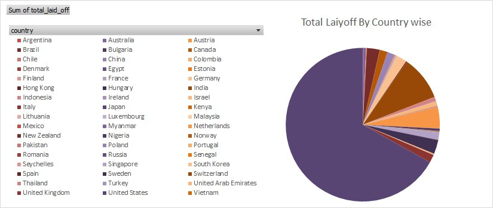
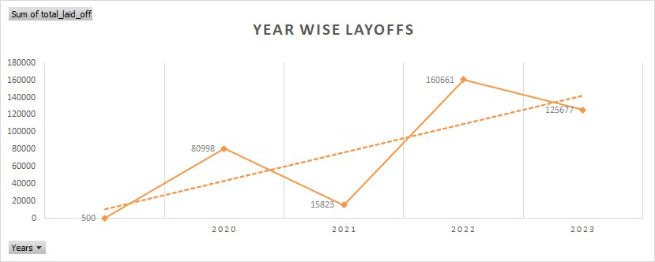
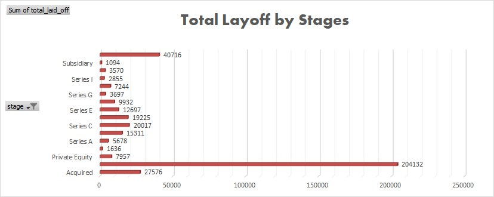
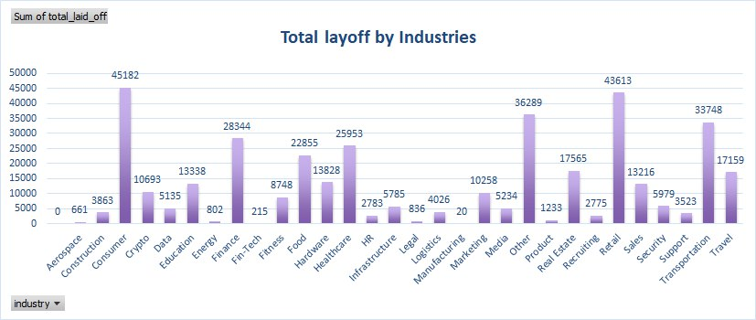
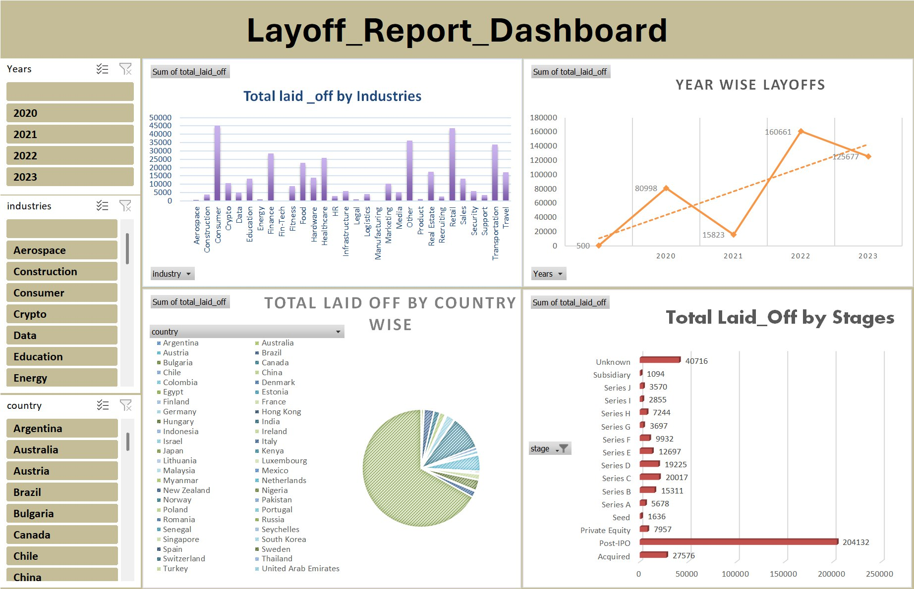
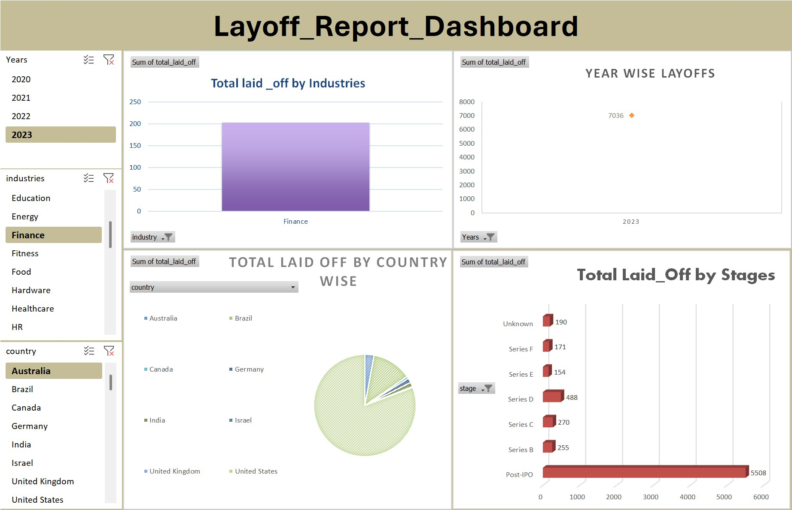

<h1 align="center">World wide layoff report</h1>

## Description

Provide a brief description of the project here. Explain the purpose and goals of the project.

<!-- Visualization Section with 6 Images -->
## Visualization

<p align="center">
  
  
  
  
</p>
<p align="center">
  
  
</p>

<!-- Tools Utilized Section -->
## Tools Utilized

- **Python**: For data analysis and manipulation.
- **Pandas**: For handling and processing data.
- **Matplotlib & Seaborn**: For creating visualizations.
- **Jupyter Notebook**: For interactive data analysis.
- **NumPy**: For numerical operations.
- **Scikit-learn**: For machine learning algorithms.

## Installation

Instructions for installing necessary packages and setting up the environment:

```bash
# Clone the repository
git clone https://github.com/username/repository.git
