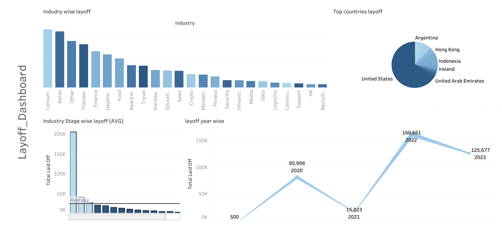

<h1 align="center">World Wide Layoff Report</h1>

<!-- Description Section -->
## Description

The project aims to compile, analyze, and visualize global layoff data to identify trends, patterns, and insights. It provides a structured dataset for researchers, analysts, and businesses to understand workforce reductions across industries, locations, and time periods. 

<!-- Dashboard Section with Images -->
## Dashboard

The dashboard is fully functional, featuring all necessary components. It dynamically interacts with all graphs and responds accurately to specific queries.

  
  

<!-- Visualization Section -->
## Visualization

  
  
  
  
  
  

<!-- Tools Utilized Section -->
## Tools Utilized

- **SQL**: For data analysis and data cleaning.
- **Excel**: For formatting the data and visualizations.